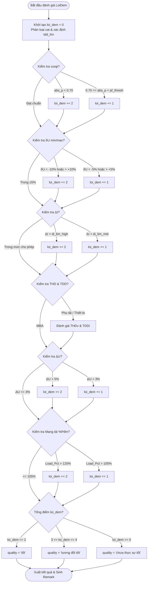

# Thuyết Minh Chi Tiết Thuật Toán Lỗi Đếm (`LoiDem` / Weighted Severity Scoring)

Tài liệu này thuyết minh chi tiết về kiến trúc, nguyên lý thiết kế, công thức tính toán và quy tắc phân cấp của **Thuật toán Cờ báo lỗi (`LoiDem`)** được triển khai trong hệ thống `plt-process`.

---

## 1. Giới thiệu & Mục tiêu Thuật toán

### 1.1. Tên gọi & Phạm vi áp dụng
- **Tên thuật toán**: Thuật toán "Cờ báo lỗi" (`LoiDem` / Domain-aware Weighted Severity Scoring).
- **Phạm vi áp dụng**: Đánh giá định lượng chất lượng vận hành điện năng (Power Quality Evaluation) cho các thiết bị điện công nghiệp, máy biến áp (MBA), phụ tải phi tuyến (VFD, VSD, Máy may Servo, Chiếu sáng, Lò hàn, HVAC Chiller, UPS...) từ dữ liệu đo đạc thực tế (Excel hiện trường & máy đo KEW6315).
- **Vị trí trong codebase**: [gen_word.py](file:///Users/minhz/Desktop/POLYTEE/2026/01 - plt-process/modules/report/gen_word.py#L1052-L1127) tại hàm `_compose_remarks_from_excel_fields()`.

### 1.2. Vai trò Hệ thống
1. **Định lượng chất lượng điện năng**: Tích lũy điểm vi phạm từ 6 nhóm chỉ tiêu kỹ thuật quan trọng.
2. **Phân cấp nhãn vận hành**: Gán nhãn đánh giá chất lượng tổng quan (`"tốt"`, `"tương đối tốt"`, `"chưa thực sự tốt"`).
3. **Điều hướng sinh nhận xét tự động**: Cung cấp ngữ cảnh lỗi cho bộ tổng hợp nhận xét trong báo cáo Word (Chương 4 & Chương 5).

---

## 2. Kiến trúc & Nguyên lý Thiết kế (Design Principles)

### 2.1. Đánh giá Đa chỉ tiêu (Multi-parametric Scoring)
Thuật toán tổng hợp vi phạm từ 6 nhóm thông số điện năng:
1. Hệ số công suất $\cos\phi$ (Power Factor)
2. Độ lệch điện áp danh định $\delta U$ (Nominal Voltage Deviation)
3. Mất cân bằng dòng điện $\Delta I$ (Current Unbalance)
4. Sóng hài điện áp $THD_V$ & Dòng điện $TDD_I$ (Harmonic Distortion)
5. Mất cân bằng điện áp $\Delta U$ (Voltage Unbalance)
6. Mức mang tải & Quá tải $\%P_{đm}$ (Load Ratio / Overload)

### 2.2. Thích ứng theo Tự nhiên Phụ tải (Domain-Aware & Adaptive Thresholds)
Điểm cải tiến vượt trội của `LoiDem` là khả năng tự động phân loại thiết bị (`cat` / `kind`) để áp dụng dung sai và ngưỡng giới hạn phù hợp với đặc tính vật lý của từng loại phụ tải:
- **Thiết bị phi tuyến (VFD, VSD, Máy may Servo, Chiếu sáng, Lò hàn...)**: Chấp nhận mức sóng hài dòng $TDD$ lớn hơn và lệch pha dòng $\Delta I$ cao hơn do đặc tính đóng ngắt nhịp công nghệ và khâu chỉnh lưu phi tuyến.
- **Phụ tải 1 pha & Chiếu sáng tòa nhà**: Nâng ngưỡng dung sai mất cân bằng dòng $\Delta I$ từ $10\%/20\%$ lên $15\%/25\%$.
- **Máy biến áp (MBA)**: Áp dụng tiêu chuẩn hệ số công suất nghiêm ngặt hơn ($\cos\phi \ge 0.90$).

### 2.3. Phân cấp Trọng số Điểm phạt (Weighted Severity)
Khởi tạo: `loi_dem = 0`.
- **Vi phạm nhẹ / Cảnh báo (+1 điểm)**: Thông số vượt ngưỡng chuẩn nhưng chưa tới mức đe dọa sự cố.
- **Vi phạm nặng / Nghiêm trọng (+2 điểm)**: Thông số vi phạm nghiêm trọng tiêu chuẩn kỹ thuật (ví dụ: quá tải >120%, THD >12%, cosφ < 0.70, δU vượt ±10%).

---

## 3. Chi tiết 6 Hạng mục Đánh giá & Quy tắc Phạt Điểm

### 3.1. Hệ số Công suất ($\cos\phi$)
- **Ngưỡng đạt chuẩn ($pf\_thresh$)**:
  - Máy biến áp (`mba`): $pf\_thresh = 0.90$.
  - Phụ tải / thiết bị khác: $pf\_thresh = 0.80$.
- **Quy tắc cộng điểm**:
  - $|\cos\phi| < 0.70$: `loi_dem += 2` (Lỗi nặng - vi phạm nguy cơ bị phạt công suất phản kháng).
  - $0.70 \le |\cos\phi| < pf\_thresh$: `loi_dem += 1` (Lỗi nhẹ - thấp hơn chuẩn).
  - $|\cos\phi| \ge pf\_thresh$: `+0 điểm`.

### 3.2. Độ lệch Điện áp Danh định ($\delta U$)
- **Công thức tính**:
  $$\delta U_{lo} = \frac{U_{min} - V_{ref}}{V_{ref}} \times 100\%, \quad \delta U_{hi} = \frac{U_{max} - V_{ref}}{V_{ref}} \times 100\%$$
  *(Trong đó $V_{ref}$ mặc định là $380\text{ V}$ hoặc $400\text{ V}$ theo định danh mạng điện).*
- **Quy tắc cộng điểm**:
  - $\delta U_{lo} < -10.0\%$ hoặc $\delta U_{hi} > +10.0\%$: `loi_dem += 2` (Lỗi nặng - điện áp trôi > $\pm 10\%$).
  - $\delta U_{lo} < -5.0\%$ hoặc $\delta U_{hi} > +5.0\%$: `loi_dem += 1` (Lỗi nhẹ - trôi > $\pm 5\%$).
  - Ngược lại: `+0 điểm`.

### 3.3. Mất cân bằng Dòng điện ($\Delta I$)
- **Ngưỡng dung sai thích ứng**:
  - Với `cat` $\in$ (`servo_sewing`, `lighting`, `building_1pha`): $di\_lim\_mid = 15.0\%$, $di\_lim\_high = 25.0\%$.
  - Phụ tải 3 pha tiêu chuẩn: $di\_lim\_mid = 10.0\%$, $di\_lim\_high = 20.0\%$.
- **Quy tắc cộng điểm**:
  - $\Delta I > di\_lim\_high$: `loi_dem += 2` (Mất cân bằng dòng nghiêm trọng).
  - $di\_lim\_mid < \Delta I \le di\_lim\_high$: `loi_dem += 1` (Mất cân bằng dòng trung bình).
  - Ngược lại: `+0 điểm`.

### 3.4. Sóng hài Điện áp ($THD_V$) & Dòng điện ($TDD_I$)
*(Chỉ đánh giá cho thiết bị/phụ tải, không áp dụng phạt trùng lặp cho MBA).*

#### a) Sóng hài Điện áp ($THD_V$):
- $THD_V > 12.0\%$: `loi_dem += 2` (Biến dạng áp cực kỳ nghiêm trọng).
- $8.0\% < THD_V \le 12.0\%$: `loi_dem += 1` (Vượt ngưỡng tiêu chuẩn TCVN/IEEE 519 là $8.0\%$).

#### b) Sóng hài Dòng điện ($TDD_I$):
- **Ngưỡng cơ sở $TDD_{lim}$**:
  - MBA hoặc Phụ tải công suất lớn ($P > 50\text{ kW}$) hoặc phụ tải phi tuyến (VSD, VFD, Compressor, Chiller, UPS, Lò hàn, Solar): $TDD_{lim} = 12.0\%$.
  - Phụ tải nhỏ ($\le 50\text{ kW}$) hoặc phụ tải khác: $TDD_{lim} = 20.0\%$.
- **Hệ số dung sai ($mult$)**:
  - Phụ tải phi tuyến / công nghiệp đặc thù: $mult\_mid = 1.5$, $mult\_high = 2.5$.
  - Phụ tải thường: $mult\_mid = 1.0$, $mult\_high = 2.0$.
- **Quy tắc cộng điểm**:
  - $TDD_I > mult\_high \times TDD_{lim}$: `loi_dem += 2`.
  - $mult\_mid \times TDD_{lim} < TDD_I \le mult\_high \times TDD_{lim}$: `loi_dem += 1`.

### 3.5. Mất cân bằng Điện áp ($\Delta U$)
- Mất cân bằng áp 3 pha tạo dòng thứ tự ngược gây tổn hao phụ và phát nhiệt cuộn dây.
- **Quy tắc cộng điểm**:
  - $\Delta U > 5.0\%$: `loi_dem += 2` (Lỗi nghiêm trọng, vượt chuẩn $5.0\%$).
  - $3.0\% < \Delta U \le 5.0\%$: `loi_dem += 1` (Cảnh báo).
  - Ngược lại ($\Delta U \le 3.0\%$): `+0 điểm`.

### 3.6. Mức Mang tải & Quá tải ($\%P_{đm}$)
- **Công thức tính tỷ lệ mang tải ($\text{Load\_Pct}$)**:
  $$\text{Load\_Pct} = \frac{P_{kW} / |\cos\phi|}{S_{đm,kVA}} \times 100\% \quad \left(\text{nếu } |\cos\phi| > 0.01\right)$$
- **Quy tắc cộng điểm**:
  - $\text{Load\_Pct} > 120.0\%$: `loi_dem += 2` (Quá tải nghiêm trọng >120%).
  - $105.0\% < \text{Load\_Pct} \le 120.0\%$: `loi_dem += 1` (Quá tải nhẹ >105%).
  - Ngược lại ($\le 105.0\%$): `+0 điểm`.

---

## 4. Ma trận Trọng số Phạt & Xếp loại Chất lượng

### 4.1. Bảng Ma trận Trọng số Cờ Báo Lỗi

| Nhóm thông số | Chỉ tiêu | Điều kiện phạt +1 điểm | Điều kiện phạt +2 điểm | Ghi chú điều kiện |
|---|---|---|---|---|
| **Cos$\phi$** | Hệ số công suất | $0.70 \le \|\cos\phi\| < pf\_thresh$ | $\|\cos\phi\| < 0.70$ | $pf\_thresh = 0.90$ (MBA), $0.80$ (Khác) |
| **$\delta U$** | Điện áp danh định | $\| \delta U \| > 5.0\%$ | $\| \delta U \| > 10.0\%$ | So sánh $U_{min}, U_{max}$ với $V_{ref}$ |
| **$\Delta I$** | Lệch pha dòng | $\Delta I > di\_lim\_mid$ | $\Delta I > di\_lim\_high$ | Thường: $10\% / 20\%$. Phụ tải đặc biệt: $15\% / 25\%$ |
| **$THD_V$** | Sóng hài áp | $8.0\% < THD_V \le 12.0\%$ | $THD_V > 12.0\%$ | Chỉ áp dụng phụ tải (trừ MBA) |
| **$TDD_I$** | Sóng hài dòng | $TDD_I > mult\_mid \times TDD_{lim}$ | $TDD_I > mult\_high \times TDD_{lim}$ | Phụ tải phi tuyến: $mult = 1.5 / 2.5$; Thường: $1.0 / 2.0$ |
| **$\Delta U$** | Lệch pha áp | $3.0\% < \Delta U \le 5.0\%$ | $\Delta U > 5.0\%$ | Đánh giá mất cân bằng áp 3 pha |
| **Quá tải** | $\%P_{đm}$ | $105.0\% < \text{Load\_Pct} \le 120.0\%$ | $\text{Load\_Pct} > 120.0\%$ | Tỷ lệ công suất mang tải thực tế |

### 4.2. Thang Phân cấp Chất lượng Vận hành (Quality Levels)

Hệ thống phân cấp đánh giá vận hành thành 3 mức dựa trên tổng điểm phạt `loi_dem`:

$$\text{Chất lượng vận hành} = \begin{cases} \textbf{"tốt"} & \text{khi } loi\_dem \le 2 \\ \textbf{"tương đối tốt"} & \text{khi } 3 \le loi\_dem \le 4 \\ \textbf{"chưa thực sự tốt"} & \text{khi } loi\_dem \ge 5 \end{cases}$$

---

## 5. Sơ đồ Luồng Thuật toán (Algorithm Flowchart)



---

## 6. Ứng dụng & Tổng hợp Nhận xét Tự động trong Báo cáo Word

- **Hàm thực thi chính**: `_compose_remarks_from_excel_fields()` trong [gen_word.py](file:///Users/minhz/Desktop/POLYTEE/2026/01 - plt-process/modules/report/gen_word.py#L1020).
- **Nguyên tắc tổng hợp văn bản**:
  1. **Nhất quán tên thiết bị**: Mỗi nhận xét chỉ nêu tên thiết bị đúng 1 lần ở câu đầu tiên, các câu sau sử dụng đại từ hoặc cấu trúc đồng nghĩa để tránh trùng lặp.
  2. **Giải thích nguyên nhân kỹ thuật chuyên sâu**:
     - *Biến tần (VFD/VSD)*: Tự động lồng ghép giải thích nguyên nhân sóng hài dòng phát sinh từ bộ chỉnh lưu 6-pulse / nghịch lưu PWM.
     - *Chuyền máy may Servo*: Lồng ghép giải thích hiện tượng lệch pha dòng điện và tải xung do nhịp thao tác may đóng ngắt liên tục.
  3. **Tương thích an toàn XML Word**: Sử dụng các hằng ký tự `_LT` (`<`), `_GT` (`>`), `_AMP` (`&`) nhằm đảm bảo file Word template (`.docx`) không bị vỡ thẻ XML trong quá trình render của `docxtpl` / `python-docx`.

---

## 7. Kiểm thử Unit Test

Thuật toán `LoiDem` được đảm bảo tính đúng đắn thông qua bộ kiểm thử tự động tại [tests/test_remarks.py](file:///Users/minhz/Desktop/POLYTEE/2026/01 - plt-process/tests/test_remarks.py).

Các lệnh chạy kiểm thử:
```bash
.venv/bin/python -m unittest tests/test_remarks.py
```
hoặc
```bash
uv run pytest tests/test_remarks.py
```
